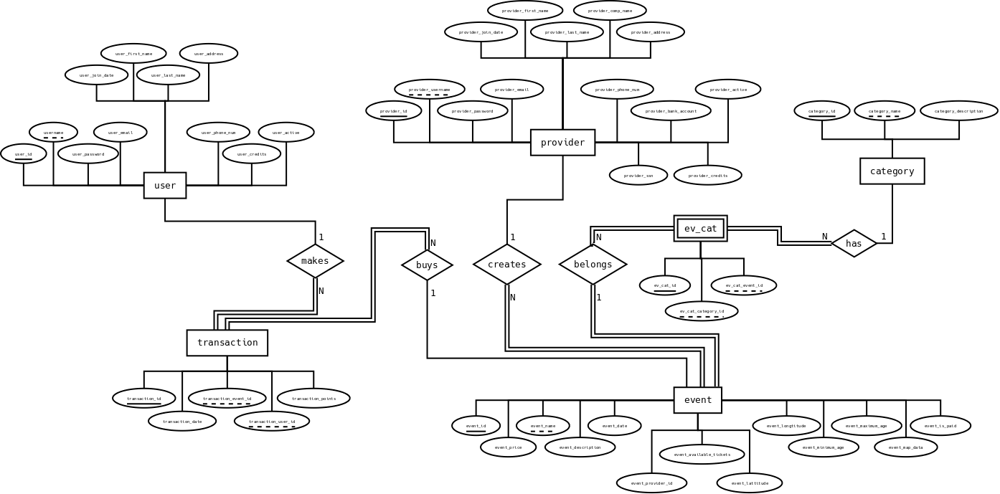
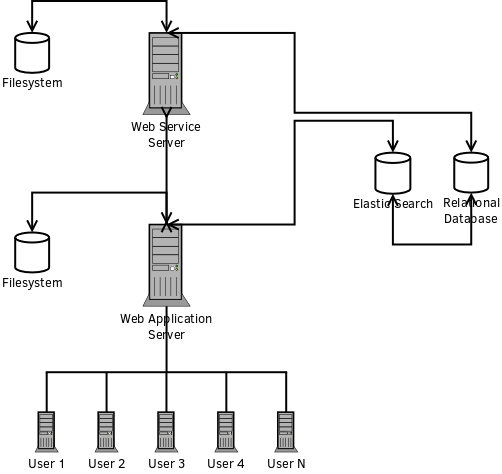

# Πρώτο Παραδοτέο

- [Πρώτο Παραδοτέο](1st.md#pp)
    - [Σκοπός](1st.md#skopos)
    - [Λειτουργικές Απαιτήσεις](1st.md#la)
        - [Παραδοχές](1st.md#paradoxes)
        - [Πελατειακή πολιτική](1st.md#pelatiakipolitiki)
        - [Περιορισμοί](1st.md#periorismoi)
        - [Σενάρια - Περιπτώσεις Χρήσης](1st.md#senaria)
            - [**ΑΝΩΝΥΜΟΣ ΧΡΗΣΤΗΣ**](1st.md#ax)
            - [**ΓΟΝΕΑΣ**](1st.md#goneas)
            - [**ΠΑΡΟΧΟΣ**](1st.md#paroxos)
            - [**ΔΙΑΧΕΙΡΙΣΤΗΣ**](1st.md#diaxiristis)
        - [Σύνοψη Ρόλων Χρηστών (Δικαιώματα και Ρόλοι)](1st.md#pinakas)
    - [Μη-Λειτουργικές Απαιτήσεις](1st.md#mla)

# Δεύτερο Παραδοτέο

- [Δεύτερο παραδοτέο](#dp)
    - [Σχεδιασμός και μοντελοποίηση](#design_modeling)
    - [Αρχιτεκτονική και συστατικά](#arch_sustatika)
    - [Διεπαφές και wireframes](#interface_wireframes)

## Σχεδιασμός και μοντελοποίηση

### Σχεσιακό Διάγραμμα Βάσης Δεδομένων

Παρακάτω παρουσιάζεται το σχεσιακό διάγραμμα της βάσης δεδομένων. Συγκεκριμένα κάθε ένας πίνακας έχει ένα πρωτεύον κλειδί και συμπληρωματικά ξένα κλειδιά σε άλλους πίνακες αν αυτά
χρειάζονται. Επίσης κάθε πεδίο πίνακα χαρακτηρίζεται ως υποχρεωτικό (δηλαδή απαγορεύεται να είναι κενό - null) και αναπαρίσταται σχηματικά με συμπαγή κουκίδα. Ακόμα
τα βέλη αναπαριστούν τα πεδία που αποτελούν ξένα κλειδιά σε άλλους πίνακες. Τέλος οι επιγραφές 1 και n στα βέλη αποτελούν τη σχέση πληθικότητας των πινάκων που ενώνουν.

### Αναλυτική Υλοποίηση Μοντέλων Βάσης Δεδομένων

Την αναλυτική υλοποίηση των μοντέλων της βάσης δεδομένων μας μπορεί να βρει κανείς στο αρχείο *models.js* στον κατάλογο backend, όπου και υλοποιείται με τη χρήση του Sequelize ORM. Σε αυτό ορίζονται οι τύποι των δεδομένων, καθώς και περιορισμοί που αφορούν την αποδεκτή μορφή των δεδομένων, αν κάποιο πεδίο στα μοντέλα μπορεί να είναι NULL ή όχι και την προεπιλεγμένη τιμή. Επίσης με τη χρήση του Sequelize, μπορούμε να γράψουμε προσαρμοσμένους επαληθευτές.

### Διάγραμμα Entity-Relation Βάσης Δεδομένων

Παρακάτω παρουσιάζεται το διάγραμμα οντοτήτων συσχετίσεων (entity-relation) της βάσης δεδομένων. Συγκεκριμένα κάθε οντότητα (ορθογώνια πλαίσια) αποτελούμενη από πεδία
(οβάλ πλαίσια) που την χαρακτηρίζουν συνδέεται μέσω συσχέτισης (ρόμβοι) με άλλες οντότητες. Οι διπλές γραμμές αναπαριστούν ολική συσχέτιση, ενώ οι μονές
μερική συσχέτιση. Τέλος οι επιγραφές 1 και Ν στις γραμμές αποτελούν την πληθικότητα των οντοτήτων που συσχετίζουν.

## Αρχιτεκτονική και συστατικά

### Σύνοψη Αρχιτεκτονικής

Σύμφωνα με την αρχιτεκτονική μας, θα έχουμε μια web service σε κάποιον server, η οποία θα είναι υπεύθυνη για την επικοινωνία της web εφαρμογής με τη βάση δεδομένων 
και με το σύστημα αρχείων για την αποστολή στατικών αρχείων. Η Elasticsearch θα επικοινωνεί με την βάση δεδομένων μας για να μπορεί εύκολα κάποιος χρήστης να κάνει
αναζήτηση ελεύθερου κειμένου. Για τον τελικό χρήστη, ο μόνος τρόπος να αλλάξει τα δομημένα δεδομένα στη Βάση Δεδομένων μας, είναι μέσω της επικοινωνίας του με την
web service κι εφόσον έχει τα αντίστοιχα δικαιώματα. Οι πελάτες / χρήστες θα χρησιμοποιούν την web εφαρμογή, η οποία θα τους δίνεται από τον web server που θα είναι
υπεύθυνος για αυτή την εργασία, με την οποία θα κάνουν χρήση της πλατφόρμας μας μέσα από τον φυλλομετρητή τους.

### Οι τεχνολογίες που θα χρησιμοποιηθούν είναι:

1. Όσον αφορά τις γλώσσες προγραμματισμού, επισήμανσης και αναπαράστασης δεδομένων
    - **JavaScript**
    - **CSS**
    - **HTML**
    - **JSON**
2. Όσον αφορά τα frameworks και τα components που θα χρησιμοποιηθούν
    - **Node.JS** (Για την υλοποίηση του Web Service)
    - **Angular 4** (Για την υλοποίηση του Frontend)
    - **Bootstrap** (Για να κάνουμε responsive design)
    - **Elasticsearch** (Για την αναζήτηση ελεύθερου κειμένου)
    - **PostgreSQL** (Για την αποθήκευση και την αναζήτηση των δομημένων δεδομέων της εφαρμογής)

## Διεπαφές και wireframes

Η διεπαφή της εφαρμογής μας θα οριστεί ακολουθώντας τις απαιτήσεις που ορίστηκαν στο
πρώτο παραδοτέο.

Όταν ο χρήστης εισέρχεται στην εφαρμογή, συναντά την αρχική σελίδα και θεωρείται προφανώς ανώνυμος χρήστης.
Η βασική φιλοσοφία σχεδιασμού είναι ότι η μπάρα αναζήτησης θα είναι συνεχώς παρούσα για κάθε χρήστη, σε όποια σελίδα της εφαρμογής
κι αν περιηγείται την κάθε δεδομένη στιγμή. Τα κύρια στοιχεία της μπάρας αναζήτησης είναι το πεδίο αναζήτησης ελεύθερου κειμένου και
το πεδίο εισαγωγής της τοποθεσίας του χρήστη. Οι δραστηριότητες θα ανήκουν η κάθε μία σε μία ή περισσότερες κατηγορίες, συνεπώς θα θέλαμε
ο χρήστης να μπορεί να αναζητήσει με βάση τις διαθέσιμες κατηγορίες. Για αυτόν τον σκοπό, οι κατηγορίες θα είναι ορατές στις σελίδες
αναζήτησης ακριβώς κάτω από την μπάρα αναζήτησης, με τη μορφή μπάρας αποτελούμενης από κουμπιά. Τα κουμπιά αυτά θα έχουν συγκεκριμένη
κατάσταση, είτε πατημένα είτε όχι, και αναλόγως αυτού θα παρουσιάζονται οι διάφορες δραστηριότητες. Αν ο χρήστης πραγματοποιήσει
αναζήτηση χωρίς να επιλέξει κατηγορίες, από προεπιλογή όλες οι κατηγορίες θεωρούνται επιλεγμένες.

Εικόνα του wireframe της αρχικής σελίδας:

Όπως φαίνεται, στην μπάρα αναζήτησης υπάρχει δίπλα στο πεδίο εισαγωγής της τοποθεσίας και ένα κουμπί που εμφανίζει έναν χάρτη από
ηλεκτρονική υπηρεσία χαρτών, όπως το Google Maps, ώστε ο χρήστης να επιλέξει από εκεί απευθείας την τοποθεσία του. Ο χάρτης θα εμφανίζεται ως
pop-up πάνω από τη σελίδα της εφαρμογής.

Ένα παράδειγμα με το αντίστοιχο wireframe:

Όταν ο χρήστης πατήσει το κουμπί της αναζήτησης, μεταβαίνει στην οθόνη αναζήτησης όπου του παρουσιάζονται αποτελέσματα ανάλογα με τα
χαρακτηριστικά που έχει επιλέξει. Μετά την πραγματοποίηση της αναζήτησης, ο χρήστης μπορεί να περιορίσει τα αποτελέσματα με βάση συγκεκριμένα
φίλτρα, που βρίσκονται στα αριστερά της οθόνης. Παραδείγματα φίλτρων αποτελούν το εύρος τιμών, το εύρος ηλικίας, η απόσταση από την τοποθεσια
του χρήστη, και άλλα.

Η σελίδα αναζήτησης για τον ανώνυμο χρήστη:

Ο χρήστης μπορεί να επιλέξει να πατήσει το αντίστοιχο κουμπί που βρίσκεται πάνω από τα αποτελέσματα, ώστε να εμφανίσει όλα τα αποτελέσματα ως
σημεία πάνω στον χάρτη της περιοχής:

Ο χρήστης μπορεί να πατήσει πάνω σε ένα από τα στοιχεία της λίστας των αποτελεσμάτων, ώστε να προβάλει πληροφορίες για την αντίστοιχη
δραστηριότητα. Μπορεί να πατήσει το κατάλληλο κουμπί πάνω δεξιά ώστε να επιστρέψει στην αναζήτησή του.

Δεξιά στην μπάρα αναζήτησης, υπάρχουν κουμπιά με τα οποία ο χρήστης μπορεί να εγγραφεί με τον ρόλο του γονέα ή με τον ρόλο του παρόχου, και
επίσης μπορεί να εισέλθει στην υπηρεσία, αν είναι ήδη εγγεγραμμένος, πάλις ως γονέας ή ως πάροχος. Η επιλογή του κουμπιού για εγγραφή οδηγεί
τον χρήστη σε ένα νέο παράθυρο (ή pop-up, δεν έχει μεγάλη διαφορά, στο wireframe χρησιμοποιηκε για ευκολία pop-up αλλά στην υλοποίηση αυτό
μπορεί να αλλάξει) όπου διαλέγει αν θέλει να εγγραφεί ως γονέας ή ως πάροχος, όπως φαίνεται και στο wireframe στην παρακάτω εικόνα:

Η επιλογή εγγραφής ως γονέας ανοίγει την αντίστοιχη σελίδα εγγραφής, όπου ο χρήστης πρέπει να συμπληρώσει τα απαραίτητα στοιχεία για να
ολοκληρώσει την εγγραφή του. Όταν την ολοκληρώσει επιτυχώς, εμφανίζεται ένα μήνυμα επιβεβαίωσης.

Ενδεικτικά wireframes:

Αν ο ανώνυμος χρήστης επιλέξει να εγγραφεί ως πάροχος υπηρεσιών, θα κατευθυνθεί στην αντίστοιχη σελίδα:

Ένας εγγεγραμμένος χρήστης μπορεί να επιλέξει να εισέλθει στην υπηρεσία με τον λογαριασμό του από το κουμπί εισόδου που βρίσκεται δίπλα στο
κουμπί εγγραφής. Σε αυτή την περίπτωση θα εμφανιστεί ένα pop-up στο οποίο θα μπορεί να βάλει τα στοιχεία του αλλά και τον τύπο λογαριασμού
με τον οποίο επιθυμεί να εισέλθει.

Όταν ο χρήστης εισέλθει στην υπηρεσία σαν γονέας, οι επιλογές στα δεξιά της μπάρας αλλάζουν ανάλογα. Για τον χρήστη, προστίθεται η δυνατότητα να μεταβεί στον λογαριασμό του, να δει το ποσό του πορτοφολιού του και να προσθέσει χρήματα σε αυτό.

Η αρχική σελίδα όταν ο χρήστης εισέλθει ως γονέας:

Η σελίδα εισαγωγής πόντων στο πορτοφόλι:

Η αναζήτηση του γονέα είναι λειτουργικά σχεδόν ίδια με την αναζήτηση του ανώνυμου χρήστη. Η διαφορά είναι πως όταν ο γονέας βλέπει λεπτομέρειες μιας 
δραστηριότητας, του παρέχεται η επιλογή να αγοράσει εισητήριο για την δραστηριόητα αυτή, αν δεν έχει αγοράσει ήδη. Αν έχει αγοράσει εισιτήριο για την δραστηριότητα, του παρέχεται η δυνατότητα να εκτυπώσει το εισιτήριό του - ή τα εισιτήριά του, αν έχει ολοκληρώσει πολλαπλές αγορές - με τα εισιτήρια να
παρουσιάζονται σε μορφή PDF.

Ο Γονέας μπορεί εν συνεχεία να εισέλθει στον λογαριασμό του, ο οποίος αποτελείται από τρία μέρη, τα Στοιχεία Γονέα, τις Τρέχουσες Δραστηριότητες και τις Παλιές δραστηριότητες.

Στα Στοιχεία Γονέα, ο γονέας μπορεί να δει τα στοιχεία του καθώς επίσης και να αλλάξει μερικά από αυτά όπως επιτρέπει η εφαρμογή.

Στις Τρέχουσες Δραστηριότητες, ο Γονέας μπορεί να δει μια λίστα με τις δραστηριότητες για τις οποίες έχει αγοράσει εισιτήριο και οι οποίες δεν έχουν ολοκληρωθεί, ώστε να μπορεί εύκολα να τις βρει και να περιηγηθεί σε αυτές. Αντίστοιχα, στις παλιές δραστηριότητες βρίσκονται οι δραστηριότητες για τις οποίες ο χρήστης έχει αγοράσει εισιτήριο και έχουν ολοκληρωθεί. Η λίστα των δραστηριοτήτων και στις δύο περιπτώσεις είναι όμοιες με τις δραστηριότητες στην αναζήτηση.

Με το κουμπί Εξόδου, ο χρήστης βγαίνει από την εφαρμογή ως εγγεγραμμένος χρήστης και επιστρέφει στην περιήγηση ως ανώνυμος χρήστης.

Αν ο χρήστης εισέλθει στην υπηρεσία ως πάροχος, έχει τη δυνατότητα να κάνει αναζήτηση δραστηριοτήτων με τον ίδιο τρόπο που θα έκανε και ο ανώνυμος χρήστης, ή να εισέλθει στο πάνελ παρόχου για να διαχειριστεί τον λογαριασμό του και τις δραστηριότητες που του ανήκουν.

Η αρχική σελίδα του παρόχου:

Στο πάνελ παρόχου υπάρχουν τρεις διαθέσιμες κατηγορίες, τα στοιχεία παρόχου, οι ενεργές δραστηριότητες, και οι ολοκληρωμένες δραστηριότητες, καθώς επίσης και ένα κουμπί που κατευθύνει τον πάροχο σε μια σελίδα δημιουργίας δραστηριότητας.

Στα στοιχεία παρόχου, αντίστοιχα με τον χρήστη, ο πάροχος μπορεί να δει τα προσωπικά του στοιχεία και να αλλάξει κάποια από αυτά εφόσον η εφαρμογή το επιτρέπει:

Το πάνελ για δημιουργία δραστηριότητας:

Οι ενεργές δραστηριότητες στο πάνελ παρόχου αντιστοιχούν στις δραστηριότητες που έχει δημιουργήσει ο πάροχος και οι οποίες δεν έχουν ακόμη ολοκληρωθεί. Ο πάροχος μπορείς να περιηγηθεί σε αυτές και, επειδή δεν έχουν ολοκληρωθεί, μπορεί να μεταβάλλει τα στοιχεία τους αν το επιθυμεί. Το γραφικό περιβάλλον για την μεταβολλή των στοιχείων μιας δραστηριότητας είναι παρόμοιο με αυτό για τη δημιουργία νέας δραστηριότητας.

Η κατηγορία των Ολοκληρωμένων Δραστηριοτήτων είναι όμοια με την κατηγορία των ενεργών, αλλά προφανώς χωρις να δίνει στον πάροχο τη δυνατότητα αλλαγής των στοιχείων της ολοκληρωμένης δραστηριότητας. Επίσης, στη λίστα των ολοκληρωμένων δραστηριοτήτων φαίνεται αν τα χρήματα από μια δραστηριότητα που αντιστοιχούν στον πάροχο έχουν αποδοθεί σε αυτόν ή όχι, και στην σελίδα της ολοκληρωμένης δραστηριότητας δίνεται στον πάροχο η δυνατότητα με ένα κουμπί να ζητήσει να περαστούν τα χρήματα που του αναλογούν στον τραπεζικό του λογαριασμό.

Τέλος, αν ο χρήστης θέλει να εισέλθει στην υηρεσία σαν εγγεγραμμένο μέλος αλλά έχει ξεχάσει τον κωδικό του, μπορεί να πατήσει τον αντίστοιχο σύνδεσμο στο pop-up εισόδου χρήστη και θα ανακατευθυνθεί σε κατάλληλη σελίδα όπου μπορεί να επιλέξει τον ρόλο του, να εισάγει το e-mail που σχετίζεται με τον λογαριασμό του και να πατήσει το κουμπί επιβεβαίωσης ώστε να αποσταλεί στο e-mail του μήνυμα με οδηγίες για την αποκατάσταση του κωδικού του.

Η σελίδα του διαχειριστή θα είναι πολύ απλή. Θα περιλαμβάνει τη λειτουργικότητα για να μπλοκάρει και να ξεμπλοκάρει λογαριασμούς χρηστών, καθώς και για την ενεργοποίηση καινούριων λογαριασμών παρόχων, οι οποίοι αφού δημιουργηθούν θα πρέπει να εγκριθούν από κάποιον διαχειριστή, αφού προηγουμένως ελεγχθεί η αυθεντικότητα του παρόχου. Ακολουθούν τα wireframes με τα πάνελ των λειτουργιών του διαχειριστή και τα popup επιβεβαίωσης της επιτυχίας της ενέργειας του διαχειριστή.

Με βάση τα παραπάνω wireframes και τις απαιτήσεις της εφαρμογής, δημιουργήσαμε το παρακάτω διάγραμμα περιπτώσεων χρήσης των χρηστών της εφαρμογής (όπως περιγράφηκε στα [Σενάρια - Περιπτώσεις Χρήσης](1st.md#senaria)), καλύπτοντας κάθε σημαντικό μονοπάτι δράσεων στην εφαρμογή:

Με τη σχέση include ορίζουμε τις δράσεις που πρέπει να έχουν προηγηθεί από τον χρήστη ώστε να μπορεί να πραγματοποιηθεί μια συγκεκριμένη δράση. Με τη σχέση extend ορίζουμε πώς μια δράση μπορεί να επιλεγεί όταν ο χρήστης βρίσκεται στο στάδιο μιας άλλης δράσης.